# The Capstone Project for Azure Machine Learning Engineer of Patients with Heart Failure

This is a final project for the Udacity Nanodegree which uses two machine learning models (AutoML and HyperDrive tuned model) to predict patients survival based on medical data obtained from Kaggle public dataset called Heart Failure Prediction (https://www.kaggle.com/datasets/fedesoriano/heart-failure-prediction).

In the project, I have created and trained two models, one using Azure AutoML and another using HyperDrive, and deploy one of the models as ACI (Azure Container Instances).

## Project Set Up and Installation

The GitHub repo contains the following files which are required to run experiments:

- automl.ipynb: the notebook for AutoML experiment
- config.json: the fie contains settings for the subscription, resource group and name of the workspace used for the experiments
- hyperparameter_tuning.ipynb: the notebook for HyperDrive experiment
- train.py: the script for training the HyperDrive model based on different hyperparameters
- hyper-outputs/model.pkl: the best model from the HyperDrive experiment
- heart-failure-clinical-data/heart-failure-clinical-records_dataset.csv: downloaded dataset from Kaggle
- automl-outputs/env.yml: Conda environment specification
- automl-outputs/model.pkl: the best model from the AutoML experiment
- automl-outputs/scoring.py: the script downloaded from Azure Machine Learning Studio used for loading and running the model

I am using Python 3.8 - AzureML as the environment for running notebooks.

In order to run the project, you have to:

- register for a free account from Kaggle to be able to download the dataset
- update the config.json file to your subscription id, resource group and workspace name. The file used is used in the automl.ipynb notebook to register the downloaded dataset in the Data Store of the Azure Machine Learning

## Dataset

### Overview

The selected dataset Heart Failure Prediction (https://www.kaggle.com/datasets/fedesoriano/heart-failure-prediction) contains medical data of patient with with cardiovascular disease. Details of the dataset can be found on Kaggle website under the link listed above. The columns and their descriptions can be found on the Kaggle website as well as in the automl.ipynb notebook, in the Dataset section.
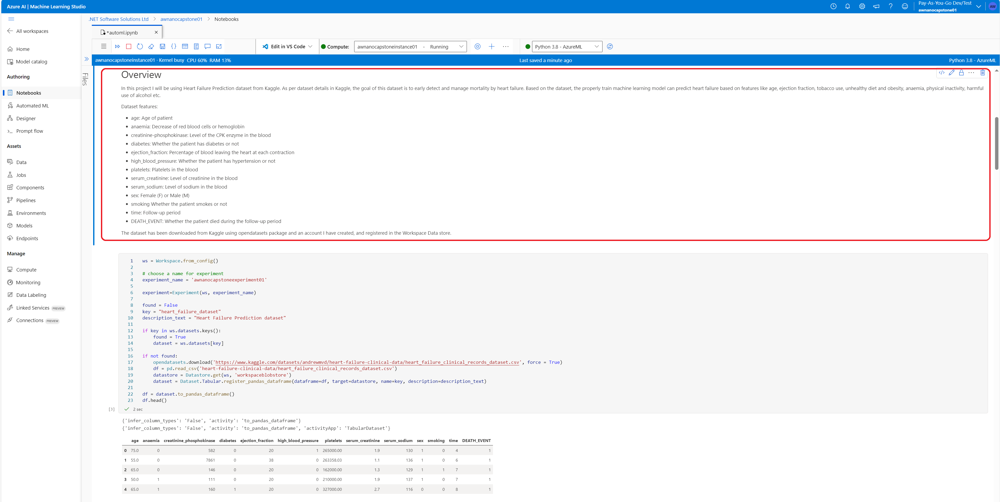

### Task

The task of this project was to create two machine learning models (AutoML and HyperDived tuned model) to classify patients based on their odds of survival.
The prediction is based on features from the dataset while the label used for training the models is the last column named DEATH_EVENT being either 0 (no) or 1 (yes) (binary classification).

### Access

To get the data, you need to create a free account in Kaggle. Next you need to run the automl.ipynb notebook - the first and the second code cells. The first code cell imports dependencies while the second code cell actually downloads the dataset (if required) and stores it in the heart-failure-clinical-data folder. I am using the opendatasets package to download the dataset. When running the second code cell, the provider will ask you for your username and password which will be used to access the dataset in Kaggle.
I am also registering the dataset in Azure Machine Learning Studio:
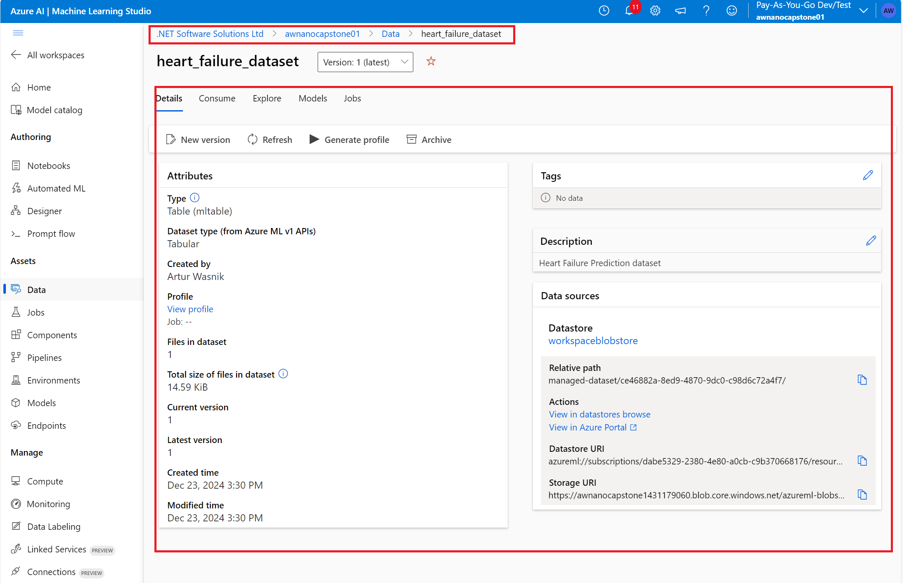

As noted before, the dataset is also stored in the heart-failure-clinical-data folder.
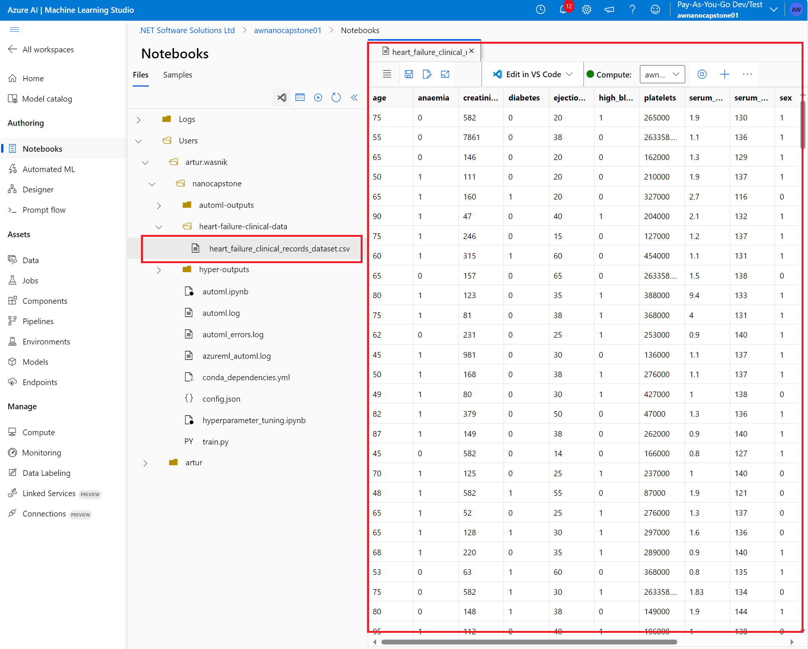

I am using the stored dataset in the train.py script when training the HyperDrive model.

## Automated ML

The AutoML settings with config descriptions I have used:
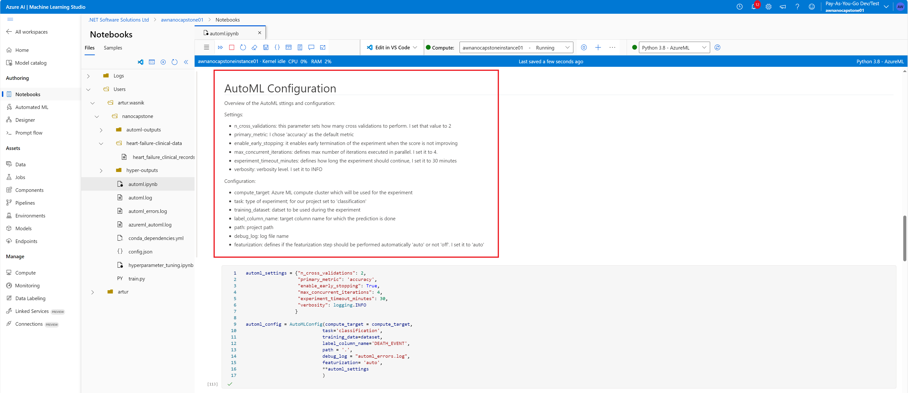

### Results

The best AutoML model algorithm: VotingEnsemble.
The best AutoML model metrics with charts:
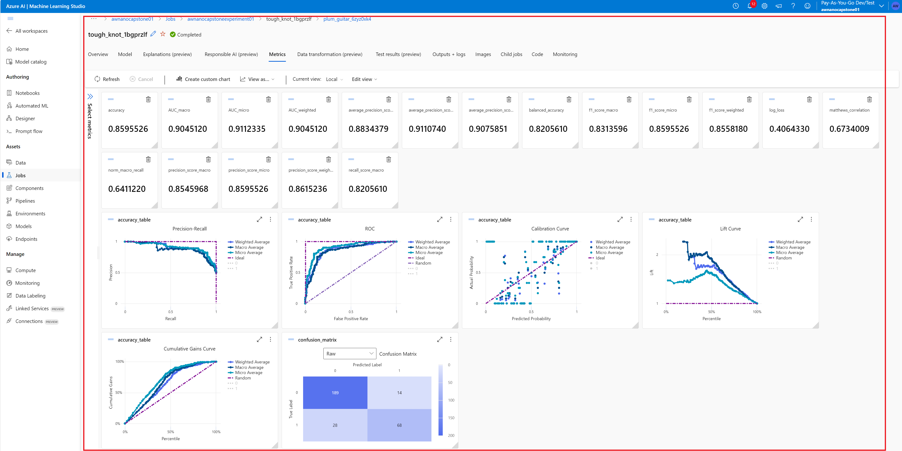
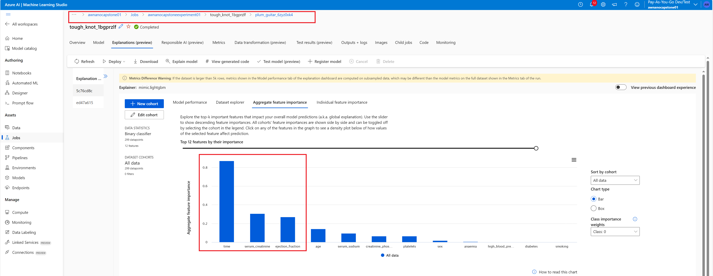
As we can see from the explanations chart, time is the most important factor, followed next by serum creatinine, ejection fraction and age. Surprisingly, at least for me, the smoking feature as well as the high blood pressure are the least contributing ones.

Best AutoML model details from the notebook:
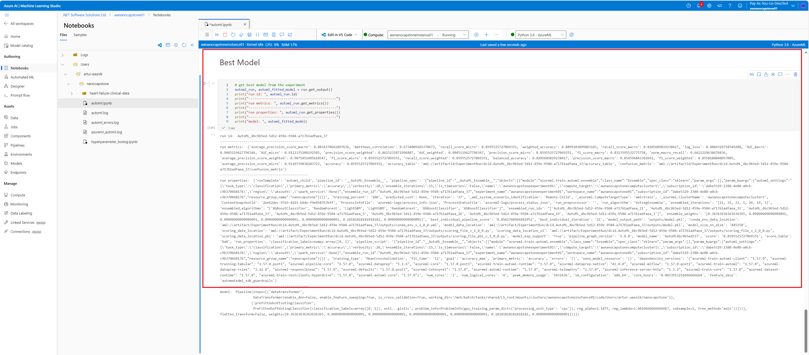

Best AutoML model from Azure Machine Learning Studio:
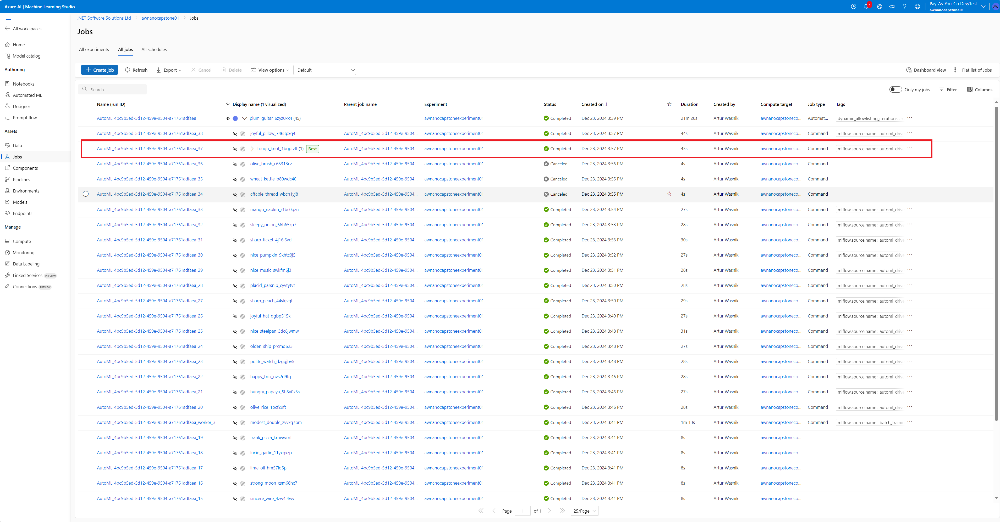

The RunDetails widget details of the best AutoML model:

I believe we could improve the results by:

- setting bigger n_cross_validation
- removing/disabling early stopping policy
- increasing experiment timeout

## Hyperparameter Tuning

Tha algorithm used for the HyperParameter training is Logistic Regression optimized by HyperDrive.
There are two hyperparameters which are tuned to find the best model (with the best accuracy):

- c : the inverse of the reqularization strength
- max_iter : Maximum number of iterations

The HyperDrive config with settings' descriptions:
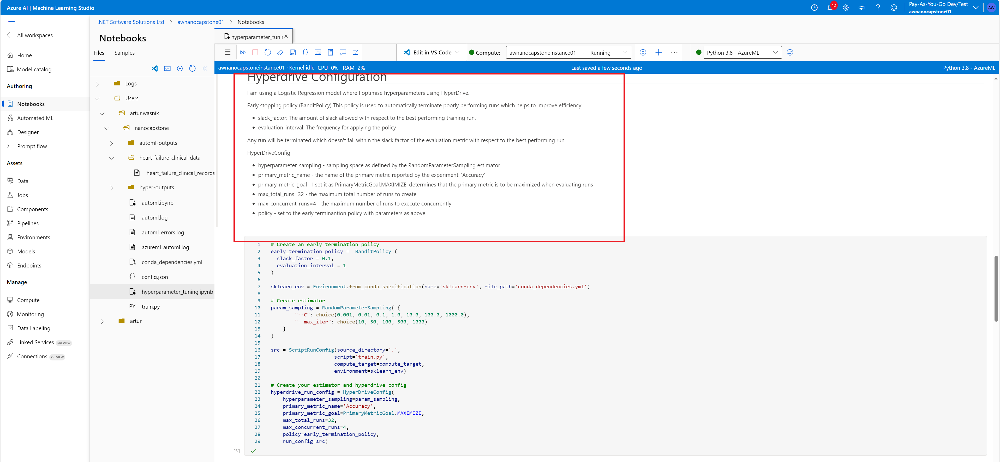

### Results

The best Logistic Regression model tuned by HyperDrive has 0.88(3) Accuracy with c=1000 and max_iterations=100.
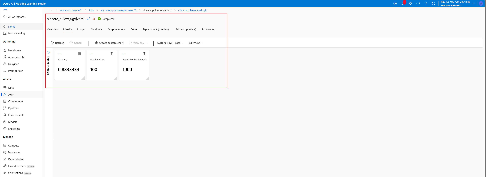

Best model details from the notebook:
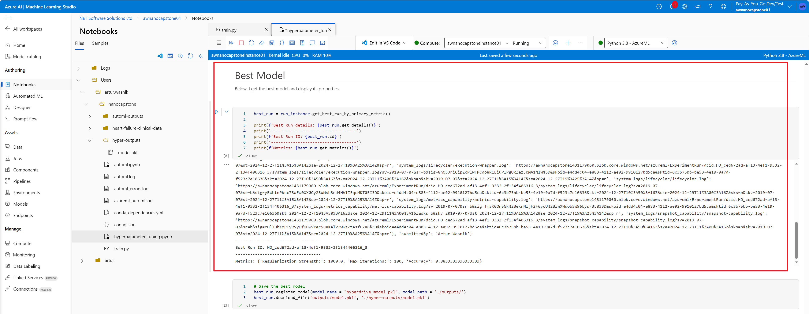
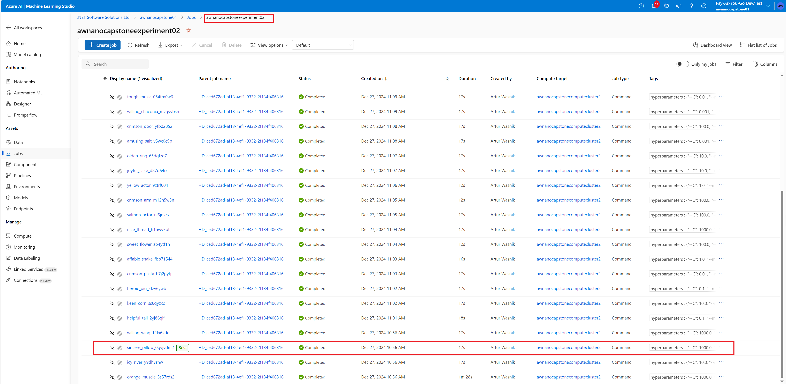

The RunDetails widget details of the best model:
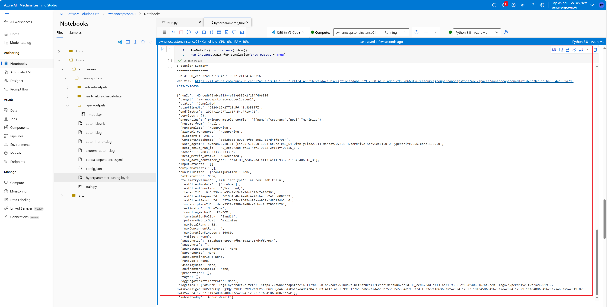

## Model Deployment

I decided to deploy the AutoML best model (the VotingEnsemble model):
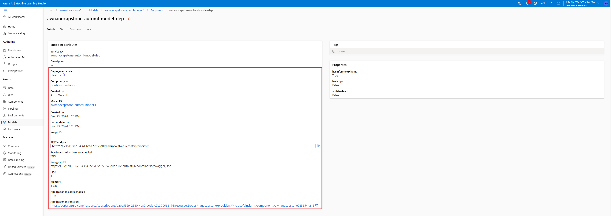

The deployment created the ACI container:
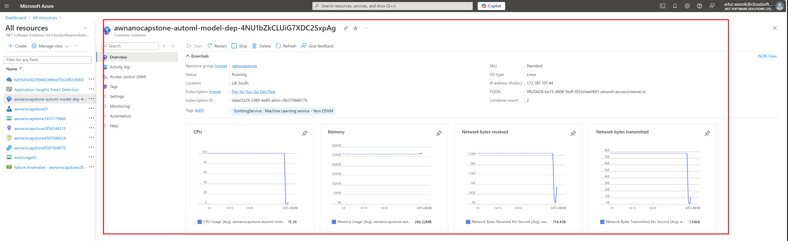

Using the browser and the Swagger endpoint, I was able to get the swagger.json file:
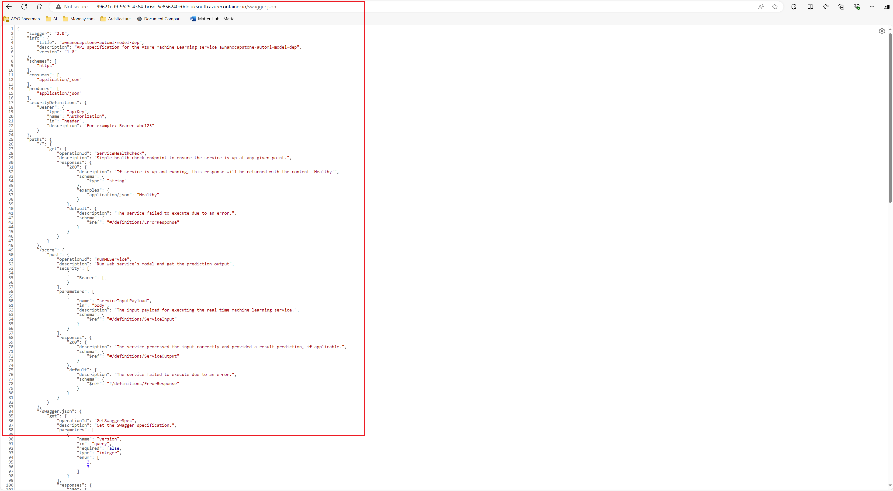

I was able also to test the endpoint using the Requests Python library in the automl.ipynb notebook.
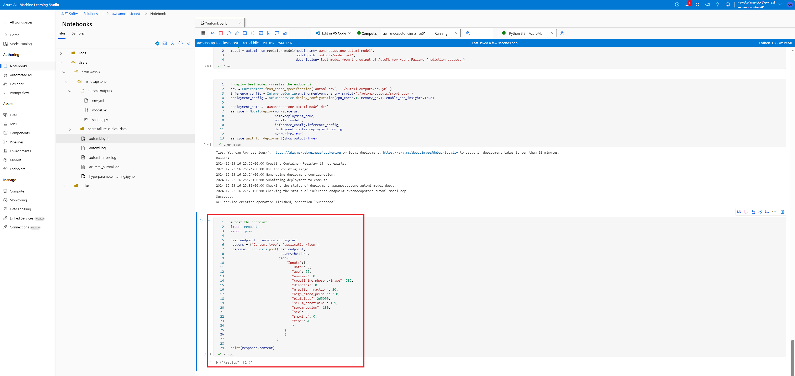

## Screen Recording
The screencast for this project can be found here: //TODO

## Comments and future improvements

- increase the training time for AutoML model. I think it would be useful to increase the training time of this model. I suspect this is one of the reasons why the AutoML model had a slightly lower score compering to the HyperDrive model
- increase the sample dataset. Currently the dataset has only 299 rows which is quite small. With bigger dataset, models could be better trained and get better scoring. I think this is one of the reasons why, to my surprise, features like smoking and high blood pressure were the least contributing ones.
- use 'Weighted Accuracy' as the primary metrics instead of 'Accuracy'. We could try to use the 'Weighted Accuracy' metrics that could help with the class imbalance we have in the dataset (as per https://www.sciencedirect.com/topics/computer-science/weighted-accuracy)
